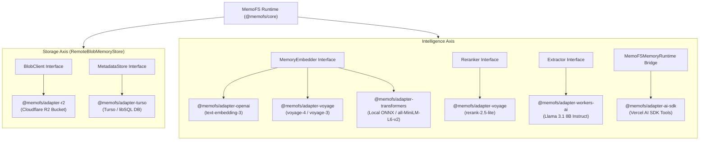

# Adapters Overview

MemoFS is designed around a strict **provider-neutral core**. The core runtime (`@memofs/core`) contains zero hard dependencies on specific LLM vendors, vector databases, object stores, or cloud hosting providers.

All external couplings — such as OpenAI embeddings, Voyage AI embeddings/reranking, local ONNX neural networks, Cloudflare R2 blob storage, Turso / libSQL metadata tables, and Vercel AI SDK runtime bridges — live in dedicated, decoupled **adapter packages**.

## The Two Adapter Axes

MemoFS separates provider integration into two distinct orthogonal axes:

1. **Storage Axis:** Translates the runtime's canonical `.memofs/` filesystem operations to remote serverless blobs and relational metadata manifests.
2. **Intelligence Axis:** Enriches local and cloud memory operations with vector embeddings, semantic reranking, graph entity extraction, and agent runtime toolkits.



## Available Adapter Packages

| Package | Category | Primary Interface | Target Environment | Key Purpose |
|---|---|---|---|---|
| **[`@memofs/adapter-openai`](/adapters/openai)** | Intelligence | `MemoryEmbedder` | Node.js (>= 22), Edge | Hosted vector embeddings via OpenAI `text-embedding-3-small`, `text-embedding-3-large`, and `ada-002`. |
| **[`@memofs/adapter-voyage`](/adapters/voyage)** | Intelligence | `MemoryEmbedder` & `Reranker` | Node.js (>= 22), Edge | High-precision domain embeddings (`voyage-4`, `voyage-3`) and neural reranking (`rerank-2.5-lite`). |
| **[`@memofs/adapter-transformers`](/adapters/transformers)** | Intelligence | `MemoryEmbedder` | Node.js (>= 22) | 100% offline, local ONNX sentence embeddings (`Xenova/all-MiniLM-L6-v2`) with zero API keys or cloud dependencies. |
| **[`@memofs/adapter-workers-ai`](/adapters/workers-ai)** | Intelligence | `Extractor` | Cloudflare Workers | Serverless entity-relationship knowledge graph extraction using `@cf/meta/llama-3.1-8b-instruct`. |
| **[`@memofs/adapter-r2`](/adapters/r2)** | Storage | `BlobClient` | Cloudflare Workers | Content-addressed raw byte storage (`r2_key === sha256`) for distributed serverless memory stores. |
| **[`@memofs/adapter-turso`](/adapters/turso)** | Storage | `MetadataStore` | Node.js (>= 22), Cloudflare Workers | Project manifest metadata and serialized transaction locking (`BEGIN IMMEDIATE`) over libSQL `project_files`. |
| **[`@memofs/adapter-ai-sdk`](/adapters/ai-sdk)** | Agent Framework | `MemoFSMemoryRuntime` | Node.js (>= 22), Edge | Vercel AI SDK tool definitions, prompt context builders, and multi-tenant memory scoping policies. |

## Contract Architecture & Provider Neutrality

Every adapter satisfies an interface defined strictly in `@memofs/core`:

1. **Storage Decoupling:** `RemoteBlobMemoryStore` in core composes an injected `BlobClient` and `MetadataStore`. The R2 blob client and Turso metadata store are published in separate packages so storage layers can be mixed and matched without N×M package bloat.
2. **Deterministic Defaults & Fallbacks:** If no embedder or extractor is configured, MemoFS continues to function safely using deterministic fallbacks (BM25 keyword search, fuzzy lexical matching, and regex rule-based graph extraction). Adding an adapter upgrades recall quality without changing your application code.
3. **No Secret Leaks:** Adapters handle client authentication locally in memory. Tokens and private keys never touch memory files or replicated git manifests.

## Composition Examples

### 1. Local Node.js with Transformers.js (Zero API Keys)

::: code-group

```ts [createNodeMemoFs (Recommended)]
import { createNodeMemoFs } from "@memofs/core/node-fs";
import { createTransformersEmbedder } from "@memofs/adapter-transformers";

const memo = createNodeMemoFs({
  rootDir: ".",
  embedder: createTransformersEmbedder(),
});
```

```ts [MemoFS Class]
import { MemoFS } from "@memofs/core";
import { createNodeFsMemoryStore } from "@memofs/core/node-fs";
import { createTransformersEmbedder } from "@memofs/adapter-transformers";

const memo = new MemoFS({
  store: createNodeFsMemoryStore({ rootDir: "." }),
  projectId: "local-app",
  mode: "local",
  embedder: createTransformersEmbedder(),
});
```

:::

### 2. Node.js with OpenAI Embeddings & Voyage Reranking

::: code-group

```ts [createNodeMemoFs (Recommended)]
import { createNodeMemoFs } from "@memofs/core/node-fs";
import { createOpenAIEmbedder } from "@memofs/adapter-openai";
import { createVoyageReranker } from "@memofs/adapter-voyage";

const memo = createNodeMemoFs({
  rootDir: ".",
  embedder: createOpenAIEmbedder({
    apiKey: process.env.OPENAI_API_KEY!,
    model: "text-embedding-3-small",
  }),
  reranker: createVoyageReranker({
    apiKey: process.env.VOYAGE_API_KEY!,
    model: "rerank-2.5-lite",
  }),
});
```

```ts [MemoFS Class]
import { MemoFS } from "@memofs/core";
import { createNodeFsMemoryStore } from "@memofs/core/node-fs";
import { createOpenAIEmbedder } from "@memofs/adapter-openai";
import { createVoyageReranker } from "@memofs/adapter-voyage";

const memo = new MemoFS({
  store: createNodeFsMemoryStore({ rootDir: "." }),
  projectId: "hybrid-app",
  mode: "local",
  embedder: createOpenAIEmbedder({
    apiKey: process.env.OPENAI_API_KEY!,
    model: "text-embedding-3-small",
  }),
  reranker: createVoyageReranker({
    apiKey: process.env.VOYAGE_API_KEY!,
    model: "rerank-2.5-lite",
  }),
});
```

:::

### 3. Serverless Cloudflare Worker with R2, Turso, and Workers AI

```ts
import { MemoFS, RemoteBlobMemoryStore } from "@memofs/core";
import { createR2BlobClient } from "@memofs/adapter-r2";
import { createTursoMetadataStore } from "@memofs/adapter-turso";
import { createWorkersAiExtractor } from "@memofs/adapter-workers-ai";
import { createClient } from "@libsql/client";

export interface Env {
  BLOBS: R2Bucket;
  TURSO_DATABASE_URL: string;
  TURSO_AUTH_TOKEN: string;
  AI: Ai;
}

export default {
  async fetch(request: Request, env: Env): Promise<Response> {
    const dbClient = createClient({
      url: env.TURSO_DATABASE_URL,
      authToken: env.TURSO_AUTH_TOKEN,
    });

    const projectId = "team-proj-123";

    // Compose storage from decoupled R2 blob client and Turso metadata store
    const store = new RemoteBlobMemoryStore({
      blobClient: createR2BlobClient({ binding: env.BLOBS }),
      metadata: createTursoMetadataStore({ client: dbClient, projectId }),
      rootKey: projectId,
    });

    const memo = new MemoFS({
      store,
      projectId,
      mode: "local",
      extractor: createWorkersAiExtractor({ ai: env.AI }),
    });

    // Handle memory requests...
    const context = await memo.context({ query: "architecture standards" });
    return new Response(JSON.stringify(context), {
      headers: { "Content-Type": "application/json" },
    });
  },
};
```

## See Also

- [OpenAI Adapter Reference](/adapters/openai)
- [Voyage AI Adapter Reference](/adapters/voyage)
- [Transformers.js Adapter Reference](/adapters/transformers)
- [Workers AI Adapter Reference](/adapters/workers-ai)
- [Cloudflare R2 Adapter Reference](/adapters/r2)
- [Turso / libSQL Adapter Reference](/adapters/turso)
- [Vercel AI SDK Adapter Reference](/adapters/ai-sdk)

