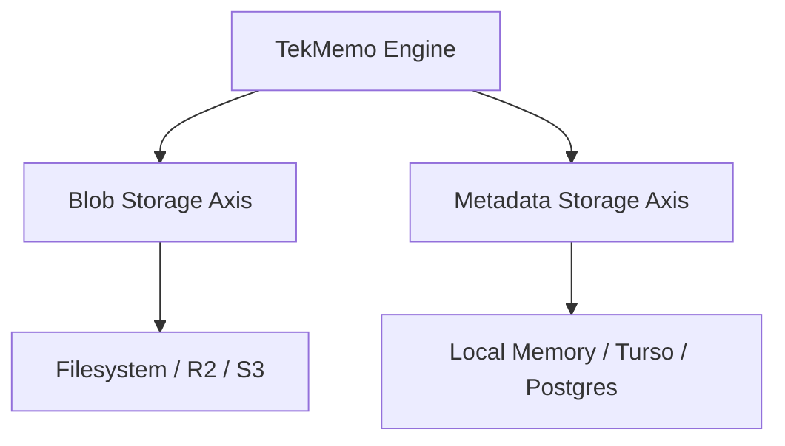

# Configure Storage

TekMemo uses a **2-axis storage architecture** that decouples file-based content storage from query-based index and metadata tracking. This split ensures high durability and performance across local and cloud environments.

---

## The 2-Axis Storage Model

Storage is separated into two independent systems:



### 1. Blob Storage Axis (`BlobClient` / File Store)
Handles raw file storage (markdown memory blocks, raw event streams, and snapshot payloads).
- **Default:** In local mode, files are written directly to your disk under `.tekmemo/`.
- **Cloud/Distributed:** In hybrid mode or self-hosted server tiers, files are stored in blob storages like Cloudflare R2 or Amazon S3.
- **Relevant Adapters:**
  - [Cloudflare R2](../packages/adapters/r2)
  - S3-compatible stores

### 2. Metadata Storage Axis (`MetadataStore` / Query Store)
Tracks indexes, relational graphs, transactional status, and search schemas. It powers the relational knowledge graph and fast search filters.
- **Default:** Local SQLite or in-memory caches.
- **Cloud/Distributed:** Production-grade metadata layers (Turso, Postgres, or serverless SQL).
- **Relevant Adapters:**
  - [Turso / libSQL](../packages/adapters/turso)
  - Postgres-compatible databases

---

## Local Development vs. Cloud Deployments

- **Local Development:** When executing locally with `mode: "local"`, you do not need to configure anything. TekMemo automatically uses standard filesystem storage.
- **Cloud Deployments:** For production services or distributed teams, you configure the axes independently in your initialization script.

### Configuration Example

```ts
import { Tekmemo } from "@tekmemo/core";
import { createR2BlobClient } from "@tekmemo/adapter-r2";
import { createTursoMetadataStore } from "@tekmemo/adapter-turso";

const memo = new Tekmemo({
  projectId: "prod-workspace",
  mode: "hybrid",
  
  // Inject R2 for raw storage
  store: createR2BlobClient({
    bucket: process.env.R2_BUCKET_NAME,
    accountId: process.env.CF_ACCOUNT_ID,
  }),
  
  // Inject Turso for fast graph queries
  recallStore: createTursoMetadataStore({
    url: process.env.TURSO_DB_URL,
    authToken: process.env.TURSO_DB_TOKEN,
  }),
});
```
