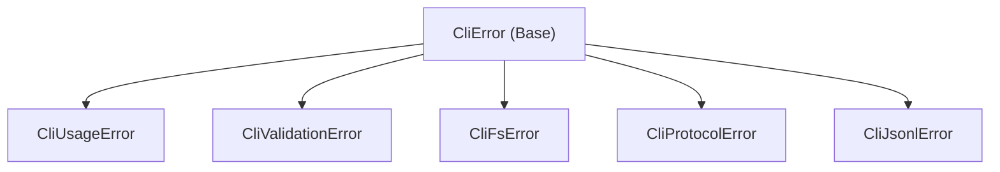

The `@memofs/cli` package exports its programmatic runner, configuration generator, error classes, protocol constants, output writers, and memory filesystem inspection utilities.

## Package Subpaths

```ts
// Primary entry point (Node.js runtime)
import {
  runMemoFsCli,
  createMemoFSFromCli,
  writeDefaultCliConfig,
  resolveSchemaPath,
  inspectMemoFs,
  CliError,
  CliUsageError,
} from "@memofs/cli";

// JSON Schema for .memofs/config.json
import configSchema from "@memofs/cli/schema/config.json" with { type: "json" };
```

---

## 1. CLI Runner & Client Factory

### `runMemoFsCli(input: RunMemoFSCliInput): Promise<RunMemoFSCliResult>`

Executes the MemoFS CLI command pipeline programmatically using Commander, routing stdout and stderr to the output collector.

```ts
import { runMemoFsCli } from "@memofs/cli";

const result = await runMemoFsCli({
  argv: ["remember", "Use libSQL for local database", "--kind", "decision"],
  cwd: process.cwd(),
});

console.log("Exit code:", result.exitCode);
console.log("Stdout lines:", result.stdout);
console.log("Stderr lines:", result.stderr);
```

#### Parameters

```ts
interface RunMemoFSCliInput {
  argv: string[];
  cwd?: string;
  output?: CliOutput;
  verbose?: boolean;
  quiet?: boolean;
  noColor?: boolean;
  stdinContent?: string;
}

interface RunMemoFSCliResult {
  exitCode: number;
  stdout: string[];
  stderr: string[];
}
```

---

### `createMemoFSFromCli(options?: CliMemoFSOptions): MemoFS`

Instantiates and configures a [`MemoFS`](/api/core) class instance by resolving CLI flag options, environment variables, and project `.memofs/config.json`.

```ts
import { createMemoFSFromCli } from "@memofs/cli";

// 1. Create client with CLI options (inherits env vars & config.json)
const memo = createMemoFSFromCli({
  root: "./my-project",
  runtime: "hybrid",
  cloudUrl: "https://memofs.dev/api/v1",
  apiKey: process.env.MEMOFS_API_KEY,
  timeoutMs: 15000,
});

// 2. Perform core memory operations
await memo.writeMemory({
  content: "Use libSQL for local SQLite replication",
  kind: "decision",
  title: "Local Database Engine",
  tags: ["database", "storage"],
});

// 3. Build token-budgeted prompt context
const context = await memo.context({
  query: "how to configure database storage",
  taskType: "coding",
  maxBytes: 12000,
});

// 4. Query hybrid recall directly
const recall = await memo.recall("database migrations", {
  limit: 5,
});

// 5. Create snapshots
const snapshot = await memo.snapshots.create({ label: "before-refactor" });
```

#### Options

```ts
interface CliMemoFSOptions {
  cwd?: string;
  root?: string;
  runtime?: string;
  cloudUrl?: string;
  apiKey?: string;
  workspaceId?: string;
  projectId?: string;
  timeoutMs?: string | number;
}
```

---

## 2. Configuration Management

### `writeDefaultCliConfig(input)`

Creates or overwrites `.memofs/config.json` with portable relative `$schema` references.

```ts
import { writeDefaultCliConfig, resolveSchemaPath } from "@memofs/cli";

const result = await writeDefaultCliConfig({
  cwd: process.cwd(),
  root: ".",
  force: false,
  config: {
    $schema: resolveSchemaPath(process.cwd()),
    runtime: "local",
    root: ".",
  },
});

console.log("Created:", result.created);
console.log("Path:", result.path);
```

### `resolveSchemaPath(rootDir: string): string`

Returns a portable relative path (`../node_modules/@memofs/cli/schema/config.json`) if the package schema exists on disk, or the hosted fallback URL (`https://docs.memofs.dev/schema/config.json`).

---

## 3. Protocol Utilities & Inspection

### `inspectMemoFs(store: MemoryStore, rootDir: string): Promise<MemoFsInspection>`

Performs an audit and summary scan of workspace database files, JSONL records, and graph entities.

```ts
import { inspectMemoFs } from "@memofs/cli";
import { createNodeFsMemoryStore } from "@memofs/core/node-fs";

const store = createNodeFsMemoryStore({ rootDir: "." });
const inspection = await inspectMemoFs(store, ".");

console.log("Event count:", inspection.summary.eventCount);
console.log("Graph nodes:", inspection.summary.graphNodeCount);
```

#### Output Structure

```ts
interface MemoFsInspection {
  rootDir: string;
  exists: boolean;
  manifest?: MemoFsCliManifest;
  files: Array<{
    path: string;
    exists: boolean;
    bytes: number;
    lines?: number;
    records?: number;
  }>;
  summary: {
    eventCount: number;
    conversationCount: number;
    chunkCount: number;
    graphNodeCount: number;
    graphEdgeCount: number;
    snapshotCount: number;
  };
}
```

### `parseJsonl(content: string, options?: JsonlParseOptions): JsonlRecord[]`

Parses newline-delimited JSON strings into structured records with 1-based line numbers.

### `stringifyJsonl(records: readonly Record<string, unknown>[]): string`

Serializes record arrays into newline-delimited JSON with a terminating newline.

### `validateManifest(value: unknown): MemoFsCliManifest`

Asserts and parses an unknown object against `ManifestSchema`.

### `createDefaultManifest(input?: { projectId?: string; now?: string }): MemoFsCliManifest`

Constructs a default manifest object with generated project UUID.

---

## 4. Helper Utilities

### Snapshot Utilities

- **`validateSnapshotLabel(label: string): string`**: Validates a snapshot label (1–80 chars, alphanumeric + dots/dashes/underscores, starts with letter/number).
- **`createSafeIdFromLabel(label: string, timestamp?: string): string`**: Builds a collision-safe snapshot identifier string (e.g. `manual-2026-08-16T00-00-00-000Z`).

### Secret Scanning

- **`scanForSecrets(content: string): SecretScanFinding[]`**: Scans text for API keys, private keys, JWTs, and credential assignments.
- **`redactSecretPreview(value: string): string`**: Returns an edge-preserving redacted preview of a secret string (e.g. `sk-a…bc12`).

```ts
interface SecretScanFinding {
  kind: string;
  index: number;
  preview: string;
}
```

---

## 5. Output Writers & Envelopes

### `createBufferedOutput(options?: BufferedOutputOptions): CliOutput`

Constructs an in-memory buffered implementation of `CliOutput`.

```ts
interface CliOutput {
  stdout: string[];
  stderr: string[];
  write(message: string): void;
  error(message: string): void;
  success(message: string): void;
  warn(message: string): void;
  spinner(options?: { json?: boolean }): CliSpinner;
  progress(options?: { json?: boolean }): CliProgressBar;
}
```

### `printJsonEnvelope<T>(output: CliOutput, command: string, data: T): void`

Standard envelope formatter for `--json` output:

```ts
interface JsonEnvelope<T = unknown> {
  ok: boolean;
  command: string;
  data?: T;
  error?: {
    code: string;
    message: string;
    details?: unknown;
  };
}
```

---

## 6. Error Hierarchy

All CLI errors extend `CliError` and carry a machine-readable `code` and numeric `exitCode`:



```ts
type CliErrorCode =
  | "CLI_USAGE_ERROR"
  | "CLI_VALIDATION_ERROR"
  | "CLI_FS_ERROR"
  | "CLI_PROTOCOL_ERROR"
  | "CLI_JSONL_ERROR";
```

---

## 7. Constants

```ts
export const MEMOFS_DIR = ".memofs";

export const MEMOFS_CLI_PATHS = {
  manifest: ".memofs/manifest.json",
  coreMemory: ".memofs/memory/core.md",
  notesMemory: ".memofs/memory/notes.md",
  memoryEvents: ".memofs/events/memory-events.jsonl",
  conversations: ".memofs/events/conversations.jsonl",
  chunks: ".memofs/indexes/chunks.jsonl",
  graphNodes: ".memofs/graph/nodes.jsonl",
  graphEdges: ".memofs/graph/edges.jsonl",
  snapshots: ".memofs/snapshots/snapshots.jsonl",
  snapshotsDir: ".memofs/snapshots",
  tmpDir: ".memofs/tmp",
} as const;

export const REQUIRED_DIRS = [
  ".memofs",
  ".memofs/memory",
  ".memofs/events",
  ".memofs/indexes",
  ".memofs/graph",
  ".memofs/snapshots",
  ".memofs/tmp",
] as const;

export const REQUIRED_FILES = [
  ".memofs/manifest.json",
  ".memofs/memory/core.md",
  ".memofs/memory/notes.md",
  ".memofs/events/memory-events.jsonl",
  ".memofs/events/conversations.jsonl",
  ".memofs/indexes/chunks.jsonl",
  ".memofs/indexes/embeddings.jsonl",
  ".memofs/graph/nodes.jsonl",
  ".memofs/graph/edges.jsonl",
  ".memofs/snapshots/snapshots.jsonl",
  ".memofs/connectors.json",
] as const;

export const CORE_MEMORY_SOFT_LIMIT = 200;
```
