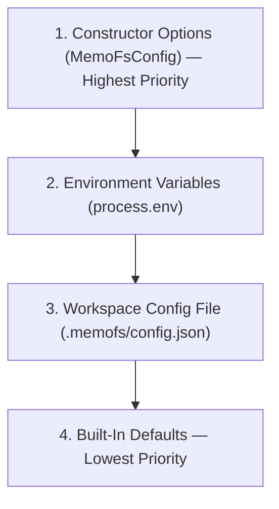

MemoFS resolves configuration through a strict 4-level precedence chain:



## Runtime Modes

MemoFS supports two primary runtime modes:

| Mode | Target | Description |
|---|---|---|
| **`local`** | Local / Zero Cloud | All reads, writes, and recall operations occur 100% locally on disk (or in-memory). Zero cloud dependencies or network calls required. |
| **`hybrid`** | Local + Cloud Sync | Reads and writes remain 100% local. Cloud connectivity is used exclusively for explicit file replication via `memofs.sync.push` and `memofs.sync.pull`. |

```ts
import { createNodeMemoFs } from "@memofs/core/node-fs";

const memofs = createNodeMemoFs({
  rootDir: ".",
  mode: "local", // or "hybrid"
});
```

## Client Options

The `MemoFsConfig` object is passed to `new MemoFS(config)` or `createNodeMemoFs(config)`:

| Property | Type | Default | Description |
|---|---|---|---|
| `store` | `MemoryStore` | (Auto in Node) | Storage adapter (`NodeFsMemoryStore`, `RemoteBlobMemoryStore`, or `InMemoryMemoryStore`). Required when using `new MemoFS()` directly. |
| `mode` | `"local" \| "hybrid"` | `"local"` | Runtime mode. |
| `rootDir` | `string` | `"."` | Workspace root directory containing `.memofs/`. Used for anchor drift path resolution. |
| `projectId` | `string` | Auto-derived | Unique project identifier. Extracted from `.memofs/manifest.json` if omitted. |
| `tenantId` | `string` | `undefined` | Optional multi-tenant identifier. |
| `workspaceId` | `string` | `undefined` | Optional sub-workspace identifier. |
| `cloud` | `MemoFsCloudClientOptions` | `undefined` | Cloud connection settings (`baseUrl`, `apiKey`, `defaultProjectId`) for hybrid mode. |
| `cloudClient` | `MemoFsCloudClient` | `undefined` | Injected custom cloud replication client instance. |
| `embedder` | `MemoryEmbedder` | `undefined` | Vector embedding provider (e.g. from `@memofs/adapter-openai`, `@memofs/adapter-voyage`, or local ONNX). |
| `reranker` | `Reranker` | Fallback | Custom reranker for retrieval results. Defaults to `DeterministicFallbackReranker`. |
| `extractor` | `Extractor` | Rule-based | Entity/edge graph extractor. Defaults to built-in rule-based extractor (`createRuleBasedExtractor`). |
| `llmClient` | `LlmClient` | `undefined` | Provider-neutral LLM client for LLM-enhanced extraction, rewriting, and consolidation. |
| `recallStore` | `RecallStore` | Auto-created | Vector/lexical storage backend (`FsRecallStore` or `InMemoryRecallStore`). |
| `recall` | `RecallEngineConfig` | `{ engine: "auto" }` | Recall engine settings (`engine`: `"lexical" \| "vector" \| "hybrid" \| "auto"`). |
| `fileConfig` | `MemoFsConfigFile` | Auto-read | Pre-parsed `.memofs/config.json` content (bypasses filesystem read). |
| `autoBootstrap` | `boolean` | `true` | Automatically creates canonical `.memofs/` files on initial read/write if missing. |
| `logger` | `MemoFsLogger` | `undefined` | Custom logger interface for debug/info events. |
| `userAgent` | `string` | `undefined` | Custom User-Agent header sent to cloud replica. |

## Node Filesystem Options

When constructing a filesystem store via `createNodeFsMemoryStore(options)`, the following options are available:

| Option | Type | Default | Description |
|---|---|---|---|
| `rootDir` | `string \| URL` | (Required) | Directory where the `.memofs/` folder lives. |
| `createRoot` | `boolean` | `true` | Automatically creates parent directories before writing. |
| `missingFileBehavior` | `"throw" \| "empty"` | `"throw"` | What `store.read()` returns if a file is missing. |
| `disallowSymlinks` | `boolean` | `true` | Prevents symlink path traversal attacks. |
| `directoryMode` | `number` | `0o700` | POSIX directory permissions. |
| `fileMode` | `number` | `0o600` | POSIX file permissions. |
| `lock` | `boolean` | `true` | Enables cross-process advisory locking (`.memofs/.lock`) to prevent concurrent writers from corrupting files. |
| `lockMaxAgeMs` | `number` | `3600000` (1h) | Max duration before a stale lock is reclaimed (guards against process crashes). |

## Workspace Config

You can commit a `.memofs/config.json` file in your repository root:

```json title=".memofs/config.json"
{
  "$schema": "https://docs.memofs.dev/schema/config.json",
  "runtime": "local",
  "projectId": "proj_abc123",
  "recall": {
    "engine": "hybrid",
    "embeddingModel": "openai/text-embedding-3-small",
    "localEmbeddings": false
  },
  "cloud": {
    "baseUrl": "https://memofs.dev/api/v1"
  }
}
```

### Reading Config Synchronously (Node.js)

`@memofs/core/node-fs` provides `readMemoFsConfigFileSync(rootDir)` to safely parse `.memofs/config.json` without throwing if the file is missing:

```ts
import { readMemoFsConfigFileSync } from "@memofs/core/node-fs";

const fileConfig = readMemoFsConfigFileSync(".");
console.log(fileConfig.projectId);
```

## Environment Variables

| Variable | Type | Default | Description |
|---|---|---|---|
| `MEMOFS_RUNTIME` | `string` | `"local"` | Overrides the runtime mode (`"local"` or `"hybrid"`). |
| `MEMOFS_PROJECT_ID` | `string` | `undefined` | Unique project workspace ID. |
| `MEMOFS_CLOUD_URL` | `string` | `https://memofs.dev/api/v1` | Base URL of the MemoFS Cloud sync API. |
| `MEMOFS_API_KEY` | `string` | `undefined` | API key (`mfs_...`) used to authenticate with MemoFS Cloud. |
| `MEMOFS_RECALL_ENGINE` | `string` | `"auto"` | Recall engine strategy: `"lexical"`, `"vector"`, `"hybrid"`, or `"auto"`. |
| `MEMOFS_LOCAL_EMBEDDINGS` | `string` | `"false"` | Set to `"1"` or `"true"` to enable local ONNX embeddings in CLI/core. In `@memofs/mcp-server`, local embeddings are enabled by default and disabled with `"0"` or `"false"`. |
| `MEMOFS_EMBEDDING_MODEL` | `string` | `undefined` | Model identifier for local or remote embeddings. |
