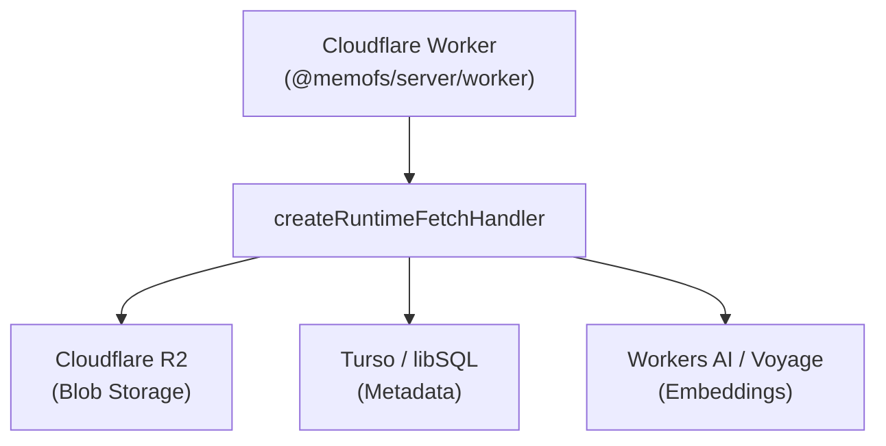

`@memofs/server` includes first-class support for Cloudflare Workers via the `@memofs/server/worker` subpath export. It allows you to run a serverless, horizontally scalable MemoFS memory backend powered by Cloudflare R2, Turso/D1, and Workers AI.

## The Cloudflare Worker Model

In Cloudflare Workers, MemoFS runs as an edge service:



## Basic Worker Entry

Use `createRuntimeFetchHandler` to export the standard Cloudflare Worker `fetch` handler:

```ts
import { createRuntimeFetchHandler } from "@memofs/server/worker";
import { createHostedRuntime } from "@memofs/server";
import { RemoteBlobMemoryStore } from "@memofs/core";
import { createR2BlobClient } from "@memofs/adapter-r2";
import { createTursoMetadataStore } from "@memofs/adapter-turso";
import { createWorkersAiExtractor } from "@memofs/adapter-workers-ai";

interface Env {
  MEMORY_BUCKET: R2Bucket;
  TURSO_URL: string;
  TURSO_TOKEN: string;
  AI: Ai;
  AUTH_SECRET?: string;
}

export default {
  fetch: createRuntimeFetchHandler({
    // Builds the runtime lazily from Cloudflare Worker bindings
    createRuntime: async (env: Env, request: Request) => {
      // 1. Resolve project ID from URL header or parameter
      const projectId = request.headers.get("x-project-id") ?? "default";

      // 2. Build Worker-safe storage adapter (R2 for files + Turso for metadata)
      const store = new RemoteBlobMemoryStore({
        blobClient: createR2BlobClient({ bucket: env.MEMORY_BUCKET }),
        metadata: createTursoMetadataStore({
          url: env.TURSO_URL,
          authToken: env.TURSO_TOKEN,
        }),
        rootKey: projectId,
      });

      // 3. Assemble the hosted runtime
      return createHostedRuntime({
        store,
        projectId,
        extractor: createWorkersAiExtractor({
          ai: env.AI,
        }),
      });
    },

    // Optional auth (disable if behind private Service Binding)
    requireAuth: false,
  }),
};
```

## Configuration

Configure your Cloudflare Worker environment with R2 bucket bindings, Turso database secrets, and Workers AI:

```jsonc title="wrangler.jsonc"
{
  "$schema": "node_modules/wrangler/config-schema.json",
  "name": "memofs-runtime-worker",
  "main": "src/index.ts",
  "compatibility_date": "2026-08-01",
  "compatibility_flags": ["nodejs_compat"],
  "r2_buckets": [
    {
      "binding": "MEMORY_BUCKET",
      "bucket_name": "my-memofs-files"
    }
  ],
  "ai": {
    "binding": "AI"
  },
  "vars": {
    "TURSO_URL": "https://my-db.turso.io"
  }
}
```

Set secret tokens securely using Wrangler:

```bash
npx wrangler secret put TURSO_TOKEN
npx wrangler secret put AUTH_SECRET
```

## Private Service Bindings (Zero-Latency Inter-Worker Communication)

In microservice architectures, you can deploy `@memofs/server` as a private runtime worker and connect to it from your API gateway or AI agent worker via Cloudflare **Service Bindings**:

### Gateway Worker

```jsonc
{
  "name": "api-gateway",
  "services": [
    {
      "binding": "MEMOFS_SERVICE",
      "service": "memofs-runtime-worker"
    }
  ]
}
```

### Calling MemoFS via Service Binding

```ts
interface Env {
  MEMOFS_SERVICE: Fetcher;
}

export default {
  async fetch(request: Request, env: Env): Promise<Response> {
    // Forward JSON-RPC request to private MemoFS Worker with zero network latency
    const rpcResponse = await env.MEMOFS_SERVICE.fetch("http://internal/rpc", {
      method: "POST",
      headers: {
        "Content-Type": "application/json",
        "x-project-id": "workspace-alice",
      },
      body: JSON.stringify({
        jsonrpc: "2.0",
        id: 1,
        method: "recall",
        params: { query: "How is authentication configured?", limit: 5 },
      }),
    });

    return rpcResponse;
  },
};
```

## Benefits of the Cloudflare Worker Deployment

- **Zero Cold Starts:** Instant response times globally distributed across Cloudflare's edge network.
- **Direct Hardware Acceleration:** Embedded Workers AI model execution without external API billing or latency.
- **Encapsulated Secrets:** Storage tokens and database credentials never leave Cloudflare's secure execution context.