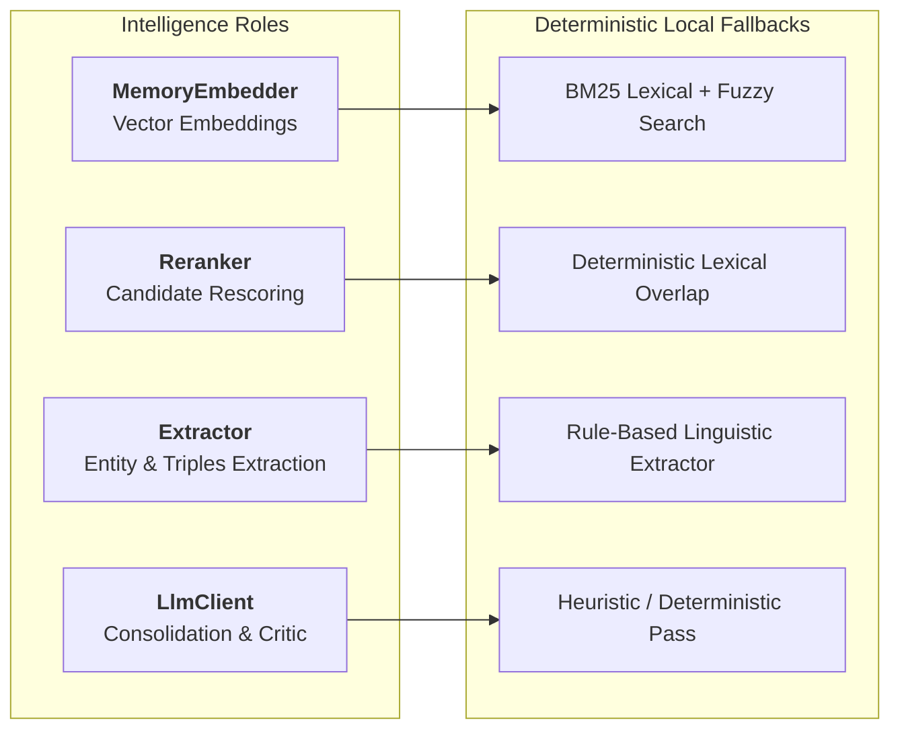

MemoFS uses a **4-role intelligence model** to power semantic search, knowledge graph extraction, and memory consolidation. Every role features a **zero-dependency deterministic local fallback** that runs without requiring third-party API keys or external model downloads.

## The 4-Role Intelligence Model



### 1. `MemoryEmbedder` (Vector Embeddings)

Computes dense vector representations for semantic similarity scoring during recall:
- **Local Fallback:** When omitted, recall operates in lexical-only mode using BM25 token frequencies and fuzzy edit distance.
- **Provider Adapters:**
  - `@memofs/adapter-openai` (`text-embedding-3-small`, `text-embedding-3-large`)
  - `@memofs/adapter-voyage` (`voyage-4`, `voyage-3`, `voyage-code-3`)
  - `@memofs/adapter-transformers` (Local in-process ONNX embeddings)

### 2. `Reranker` (Candidate Rescoring)

Re-scores and sorts retrieved candidates before returning search results:
- **Local Fallback:** `DeterministicFallbackReranker` calculates lexical token-overlap between query and candidate text.
- **Provider Adapters:**
  - `@memofs/adapter-voyage` (`rerank-2.5-lite`)

### 3. `Extractor` (Graph Entity & Edge Extraction)

Extracts entity vertices and relationship edges from prose when memories are written:
- **Local Fallback:** Built-in rule-based extractor (`createRuleBasedExtractor`) evaluating 7 linguistic structural patterns (`depends on`, `uses`, `supersedes`, `prefer`, etc.).
- **Provider Adapters:**
  - `@memofs/adapter-workers-ai` (`createWorkersAiExtractor`)

### 4. `LlmClient` (Generative Intelligence)

Provides completion capabilities for LLM-enhanced prompt briefing generation and knowledge graph consolidation:
- **Local Fallback:** Heuristic and regex-based strategist pipeline without LLM roundtrips.
- **Custom Adapters:** Any provider implementing the core `LlmClient` contract (`name`, `complete()`).

## Configuration Example

```ts
import { createHostedRuntime } from "@memofs/server";
import { InMemoryMemoryStore, createRuleBasedExtractor } from "@memofs/core";
import { createOpenAIEmbedder } from "@memofs/adapter-openai";
import { createVoyageReranker } from "@memofs/adapter-voyage";

const memofs = createHostedRuntime({
  store: new InMemoryMemoryStore(),
  projectId: "intelligence-demo",

  // 1. Vector embedder for semantic search
  embedder: createOpenAIEmbedder({
    apiKey: process.env.OPENAI_API_KEY,
    model: "text-embedding-3-small",
  }),

  // 2. Semantic reranker for high-precision recall
  reranker: createVoyageReranker({
    apiKey: process.env.VOYAGE_API_KEY,
  }),

  // 3. Knowledge graph extractor
  extractor: createRuleBasedExtractor(),
});
```
