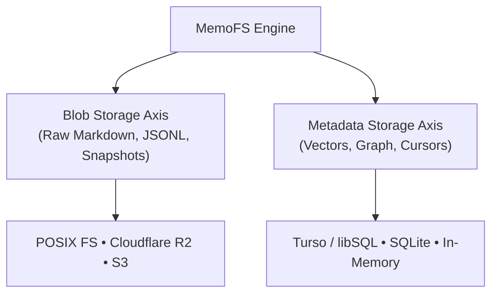

MemoFS uses a **2-axis storage architecture** that decouples raw file content storage from index and metadata tracking. This separation ensures high durability and ultra-low latency across local and distributed server tiers.

## The 2-Axis Storage Model



### 1. Blob Storage Axis

The Blob Storage Axis stores raw document bodies, snapshot archives, and event streams:
- **Local:** Managed automatically on disk under `.memofs/` via `NodeFsMemoryStore`.
- **Cloudflare Workers:** Backed by Cloudflare R2 via `@memofs/adapter-r2`.
- **AWS / S3:** Backed by S3-compatible object storage.

### 2. Metadata Storage Axis

The Metadata Storage Axis tracks embedding vectors, entity vertices, relationship edges, and replication cursors:
- **Local:** SQLite or in-memory vector index (`FsRecallStore`, `InMemoryRecallStore`).
- **Distributed:** Turso / libSQL database via `@memofs/adapter-turso` or serverless relational SQL.

## Combining the Axes

For hosted servers and Cloudflare Workers, `@memofs/core` provides `RemoteBlobMemoryStore`, which joins any `BlobClient` with any `MetadataStore` into a unified `MemoryStore`:

```ts
import { RemoteBlobMemoryStore } from "@memofs/core";
import { createHostedRuntime } from "@memofs/server";
import { createR2BlobClient } from "@memofs/adapter-r2";
import { createTursoMetadataStore } from "@memofs/adapter-turso";

// 1. Initialize R2 Blob Client
const blobClient = createR2BlobClient({
  bucket: env.R2_BUCKET,
});

// 2. Initialize Turso Metadata Store
const metadata = createTursoMetadataStore({
  url: process.env.TURSO_DB_URL!,
  authToken: process.env.TURSO_DB_TOKEN!,
});

// 3. Assemble unified store
const store = new RemoteBlobMemoryStore({
  blobClient,
  metadata,
  rootKey: "proj_production",
});

// 4. Create hosted runtime
const memofs = createHostedRuntime({
  store,
  projectId: "proj_production",
});
```

## Node.js Filesystem Storage

When running on a persistent server (Fly.io volume, Railway volume, VPS, or Docker container), you can use the local filesystem directly:

```ts
import { createNodeFsMemoryStore } from "@memofs/core/node-fs";
import { createHostedRuntime } from "@memofs/server";

const store = createNodeFsMemoryStore({
  rootDir: "/var/data/memofs",
  lock: true, // Cross-process advisory lock (.memofs/.lock)
});

const memofs = createHostedRuntime({
  store,
  projectId: "local-project",
});
```
