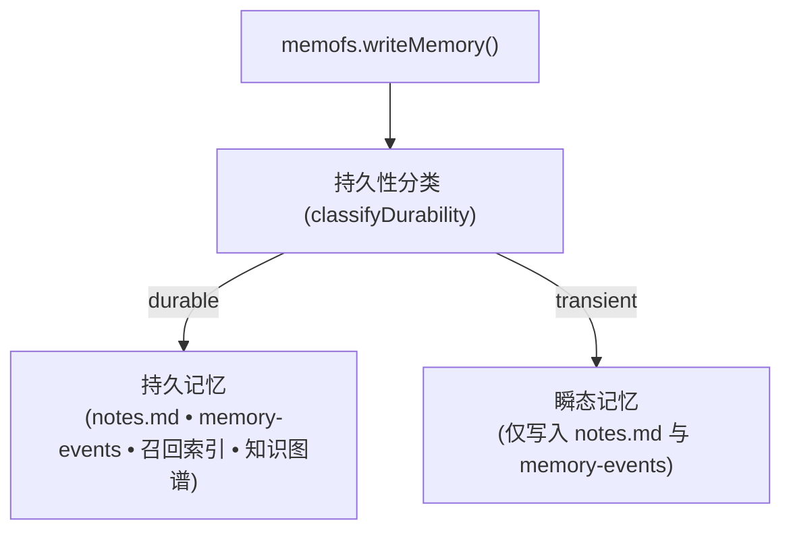

MemoFS 将智能体记忆组织为结构化、项目级的作用域分层。通过按检索频率和用途拆分记忆，系统在防止上下文膨胀的同时，最大程度保留长期的智能积累。

## 11 个规范文件布局

在你的工作区根目录下，MemoFS 在 `.memofs/` 目录中通过 11 个规范文件管理所有记忆状态：

```
.memofs/
├── manifest.json              # [1]  受跟踪的记忆资产与锚点哈希缓存
├── memory/
│   ├── core.md                # [2]  核心规范规则与基线事实
│   └── notes.md               # [3]  带时间戳的长篇归档记忆笔记
├── events/
│   ├── memory-events.jsonl    # [4]  仅追加的记忆写入与操作审计日志
│   └── conversations.jsonl    # [5]  按时间顺序记录的对话交互日志
├── indexes/
│   ├── chunks.jsonl           # [6]  用于词法召回的分块文本片段
│   └── embeddings.jsonl       # [7]  持久化的向量嵌入 (Embeddings)
├── graph/
│   ├── nodes.jsonl            # [8]  实体节点 (概念、工具、决策)
│   └── edges.jsonl            # [9]  关系三元组与依赖边
├── snapshots/
│   ├── snapshots.jsonl        # [10] 快照检查点索引
│   └── <snapshot-id>.json     # 动态快照检查点
├── connectors.json            # [11] 外部数据源连接器 (不含机密)
├── archive/
│   └── <memory-id>.json       # 全保真冷归档记忆记录
└── tmp/                       # 临时工作区工作目录
```

### 规范文件参考

| 文件 | 协议常量 | 格式 | 访问模式 | 用途 |
|---|---|---|---|---|
| `.memofs/manifest.json` | `MANIFEST_PATH` | JSON | 启动时读取 | 所有规范路径、元数据及锚点哈希缓存的清单。 |
| `.memofs/memory/core.md` | `CORE_MEMORY_PATH` | Markdown | 加载到 Prompt 上下文 | 精炼、高信噪比的项目身份标识、基线规则与约束。 |
| `.memofs/memory/notes.md` | `NOTES_MEMORY_PATH` | Markdown | 按需追加 | 带有时间戳的长篇笔记、决策和架构参考。 |
| `.memofs/events/memory-events.jsonl` | `MEMORY_EVENTS_PATH` | JSONL | 仅追加 | 记忆操作审计日志 (`memory.created`, `memory.archived` 等)。 |
| `.memofs/events/conversations.jsonl` | `CONVERSATIONS_MEMORY_PATH` | JSONL | 仅追加 | 按时间顺序排列的智能体对话轮次，用于历史重构。 |
| `.memofs/indexes/chunks.jsonl` | `CHUNKS_INDEX_PATH` | JSONL | 召回时查询 | 用于 BM25 和模糊搜索的文本分块与词法元数据。 |
| `.memofs/indexes/embeddings.jsonl` | `EMBEDDINGS_INDEX_PATH` | JSONL | 召回时查询 | 用于语义相似度评分的持久化向量嵌入。 |
| `.memofs/graph/nodes.jsonl` | `GRAPH_NODES_PATH` | JSONL | 图查询 | 实体顶点（功能、符号、概念、决策、角色）。 |
| `.memofs/graph/edges.jsonl` | `GRAPH_EDGES_PATH` | JSONL | 图查询 | 关系边（`depends_on`, `supersedes`, `uses`, `mentions`）。 |
| `.memofs/snapshots/snapshots.jsonl` | `SNAPSHOTS_INDEX_PATH` | JSONL | 按需访问 | 跟踪可用记忆快照和检查点的元数据索引。 |
| `.memofs/connectors.json` | `CONNECTORS_PATH` | JSON | 同步单元 | 外部数据源（GitHub, Notion）声明。仅使用 `secretRef`。 |

## 持久性层级 (`durable` 与 `transient`)

当通过 `memofs.writeMemory()` 写入记忆时，MemoFS 会对持久性层级进行分类：



- **`durable` (持久)**: 高价值的事实、决策和约束。写入 `notes.md`，记录在 `memory-events.jsonl` 中，并**建立索引至召回索引与知识图谱**，以指导未来的智能体会话。
- **`transient` (瞬态)**: 临时工作状态、草稿观察或低置信度推测。写入 `notes.md` 和 `memory-events.jsonl` 作为审计记录，但**绝不编入召回索引或知识图谱**。这能防止草稿思路污染 Prompt 上下文。

## 写入黑名单与机密安全

为了防止凭据意外泄露到可同步的记忆文件中，所有通过 `memofs.writeMemory()`、`memofs.core.update()` 和 `memofs.agentfs.complete()` 进行的写入都会经过**写入黑名单门控** (`assertWriteAllowed`)：

- **零配置、默认开启：** 黑名单在本地运行，没有任何外部网络依赖。
- **强硬拦截：** 包含机密材料的写入会立即抛出 `MemoryWriteBlockedError`，不会发生任何持久化。
- **安全脱敏：** 错误信息和违规预览仅包含脱敏片段（前 3 个字符 + `…` + 最后一个字符，如 `sk-…z`）—— 绝不暴露完整 Token。
