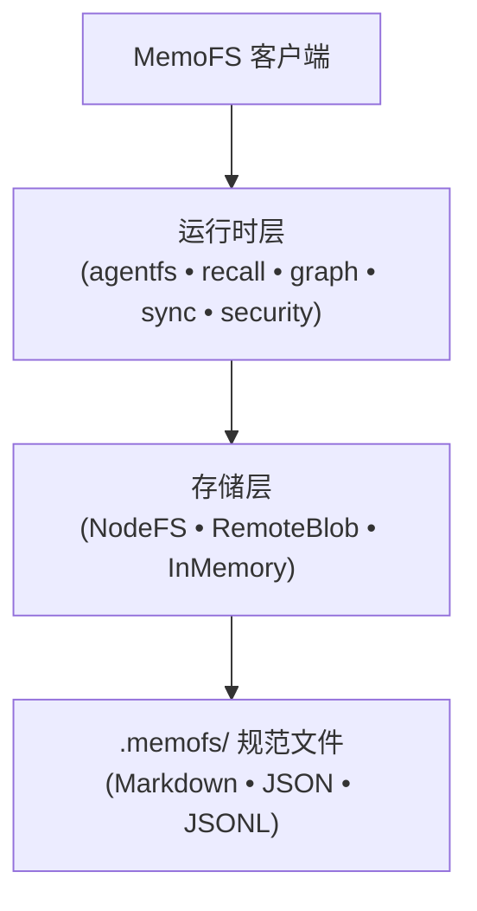

`@memofs/core` 是 MemoFS 的核心记忆运行时和中立提供商契约引擎。它为 AI 智能体的文件优先、版本化与语义化记忆提供了坚实的架构基础。

## 子路径导出

为了确保最大的运行时可移植性，`@memofs/core` 划分为三个独立的入口点：

| 子路径 | 目标环境 | 描述 |
|---|---|---|
| **`@memofs/core`** | Node.js, Cloudflare Workers, Deno, Bun, 浏览器 | **根入口 (Worker 安全)。** 导出统一的 `MemoFS` 客户端 (`new MemoFS({ ... })`)、`RemoteBlobMemoryStore`、`InMemoryMemoryStore`、提供商契约、图算法、混合召回、安全门控及类型定义。不导入任何 POSIX 文件系统模块。 |
| **`@memofs/core/node-fs`** | Node.js (>= 22) | **Node 专享入口。** 提供 `createNodeMemoFs`（返回 `new MemoFS` 的零配置工厂函数）、`createNodeFsMemoryStore`、`NodeFsMemoryStore`、同步配置读取器 `readMemoFsConfigFileSync` 以及测试临时目录辅助工具。 |
| **`@memofs/core/cloud-client`** | 任意 JavaScript 运行时 | **云端同步客户端。** 导出 `createMemoFsCloudClient`、`createMemoFsCloudClientFromEnv` 和 `createProjectScopedClient`，用于针对 MemoFS Cloud 进行两阶段文件副本同步。 |

## 安装

使用你偏好的包管理器安装 `@memofs/core`：


<Tabs items={['npm', 'pnpm', 'bun', 'deno']}>
  <Tab value="npm">
```bash
npm install @memofs/core
```
  </Tab>
  <Tab value="pnpm">
```bash
pnpm add @memofs/core
```
  </Tab>
  <Tab value="bun">
```bash
bun add @memofs/core
```
  </Tab>
  <Tab value="deno">
```bash
deno add npm:@memofs/core
```
  </Tab>
</Tabs>

<Callout type="info">
在 Node.js 运行时下执行时，需要 **Node.js >= 22**。
</Callout>

## 快速上手

### 1. Node.js 应用 (推荐)

在 Node.js 应用中，使用来自 `@memofs/core/node-fs` 的 `createNodeMemoFs` 工厂函数。它会自动解析 `.memofs/config.json`，初始化 `NodeFsMemoryStore`，并返回配置好的 `MemoFS` 客户端：

```ts
import { createNodeMemoFs } from "@memofs/core/node-fs";

// 自动在 rootDir 配置 NodeFsMemoryStore
const memofs = createNodeMemoFs({
  rootDir: ".",
  mode: "local",
});

// 如果规范的 .memofs/ 文件缺失则进行初始化
await memofs.bootstrap();

// 写入一条分类的持久化记忆
const result = await memofs.writeMemory({
  title: "数据库选型",
  content: "我们使用 Cloudflare D1 存储元数据，使用 R2 存储 Blob 对象。",
  kind: "decision",
  tags: ["architecture", "database"],
});
console.log(`已保存记忆 ${result.id} (层级: ${result.tier})`);

// 检索渐进式披露的 Prompt 上下文
const context = await memofs.context({
  query: "我们使用什么数据库存储元数据？",
  taskType: "coding",
  detail: "compact",
});
console.log(context.text);
```

### 2. Edge 与 Cloudflare Workers

对于无法使用 `node:fs` 的 Cloudflare Workers 或无服务器 Edge 运行时，直接使用 `new MemoFS({ ... })` 和 Worker 安全的存储适配器实例化 `MemoFS`，例如 `RemoteBlobMemoryStore`（由 `@memofs/adapter-r2` 和 `@memofs/adapter-turso` 支持）或 `InMemoryMemoryStore`：

```ts
import { MemoFS, RemoteBlobMemoryStore } from "@memofs/core";

// 注入 Worker 安全的 Blob 和元数据存储适配器
const store = new RemoteBlobMemoryStore({
  blobClient: r2BlobClient,       // 例如来自 @memofs/adapter-r2
  metadata: tursoMetadataStore,   // 例如来自 @memofs/adapter-turso
  rootKey: "my-project-root",
});

const memofs = new MemoFS({
  store,
  projectId: "project-123",
  mode: "local",
});

// 读取核心记忆
const coreRules = await memofs.core.read();
console.log(coreRules);
```

## 核心能力

- **文件优先的规范存储：** 所有记忆均持久化在 `.memofs/` 目录下的 11 个规范 Markdown、JSON 和 JSONL 文件中。
- **写入智能与安全性：** 内置机密黑名单 (`BLOCKLIST_RULES`)，防止 API 密钥、JWT 和密码泄露至记忆文件中。持久性分层 (`durable` 与 `transient`) 既能保留草稿笔记于审计日志，又保证搜索索引的纯净。
- **渐进式上下文交付：** `memofs.context()` 生成带有分节游标 (`expand`) 的 Token 预算受控 Prompt 简报，在防止 LLM 上下文膨胀的同时支持按需深入探索。
- **混合召回与时间衰减：** 结合 BM25 词法检索、模糊匹配与向量嵌入，并辅以指数级时间衰减（30 天半衰期）。
- **代码锚定与漂移检测：** 通过 `AnchorRef` 将记忆绑定到代码路径和 SHA-256 哈希。当代码发生变更时，事实将自动转换为 `stale` 状态并施加衰减惩罚。
- **知识图谱与记忆合并：** 抽取实体-关系三元组，执行加权最短路径遍历，合并重复实体并在不丢失历史的前提下淘汰废弃事实。
- **智能体工作区 (AgentFS)：** 提供隔离的执行沙箱 (`memofs.agentfs`)，并在任务完成时自动提取持久记忆。
- **两阶段云端同步：** 带有密码学哈希校验和单调同步游标，将本地记忆文件可靠复制至 MemoFS Cloud。

## 宏包架构

`@memofs/core` 采用模块化分层结构：



1. **`core`**: 规范 Schema、文档解析器 (`core.md`, `notes.md`, `conversations.jsonl`)、事件日志、清单验证与存储契约。
2. **`agentfs`**: 虚拟工作区文件系统、会话脚手架与记忆租约管理。
3. **`ai-runtime`**: 框架中立的契约接口 (`MemoFSMemoryRuntime`, `LlmClient`, `Extractor`, `MemoryEmbedder`, `Reranker`)。
4. **`recall`**: 混合词法 (BM25 + 模糊匹配) 与向量查询路由、余弦相似度与 4 阶段 Strategist。
5. **`graph`**: 知识图谱存储、节点/边查询引擎、加权最短路径与自动化抽取合并。
6. **`security`**: 持久性分类器与写入时机密黑名单校验。
7. **`cloud-client`**: 用于与 MemoFS Cloud 进行两阶段文件同步的 HTTP 传输客户端。

