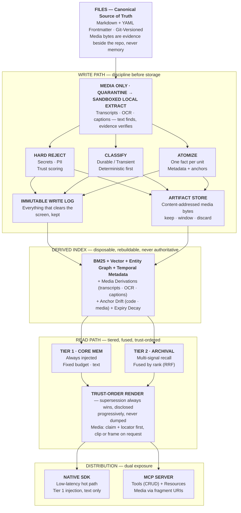

### Our mission is to give AI agents memory that anyone can read, audit, and trust, by making plain files the source of truth and everything else a view of them.[¹](#appendix)

## Agents can think. They can't yet remember.

Today's models reason across domains, write and review code, and work for hours without a human in the loop. But an agent still starts every session with amnesia. Meanwhile we're handing agents a company's infrastructure, a team's decisions, a codebase's entire history, and asking them to remember what matters for months.[²](#appendix)

The industry's default answer is the same whatever the question: embed everything, put it behind a vector database, and hope retrieval finds the right fragment at the right moment. It demos beautifully. In production it gives you a memory nobody can read, nobody can audit, and nobody can tell is wrong until an agent acts on it.

The bottleneck isn't how well agents think. It's whether they can be trusted with what they remember. A memory system that can't be read, audited, or trusted to know when it's wrong isn't infrastructure. It's a liability with good marketing.

## Files are the truth. Indexes are disposable.

The most reliable data systems learned this long ago. In a write-ahead log, or an event-sourced system, the log is the truth and the tables are views of it: derived, rebuildable, safe to throw away. Much of AI memory does it backwards. The embedding store becomes the record, and the text it was made from becomes an afterthought.

So we put the truth where engineers already trust it: markdown files with structured frontmatter, in version control. Anything you can't `git diff` isn't a record. It's a rumor with a timestamp.[³](#appendix)

```markdown
---
id: mem_7c10e3
created: 2026-07-02T16:40:00Z
source: user_message
channel: direct_session
durability: durable
confidence: high
entities: [tekmemo, staging-env]
supersedes: mem_4f2a91
---
User now prefers staging deploys on any weekday, since the team added
automated rollback and no longer needs the Friday buffer.
```

When a preference changes, the old file is never edited. A new one supersedes it, and the history stays on disk.

That one decision buys three things you can't easily buy back later. Every write is diffable, attributable, and reversible, with no bespoke versioning system to maintain. The index can be deleted and rebuilt from disk at any time, so embedding models, chunking, and ranking can change aggressively without putting the record at risk. And there's no lock-in: moving runtimes means copying files, not writing an export script and praying.

Concurrency is not hoped away. Writes are atomic and serialized per path, guarded cross-process by an advisory lock, and checked optimistically by hash so an external edit is never silently clobbered. Servers refuse mutating writes until a concurrency layer is injected, and shared workspaces coordinate through advisory leases.

## What gets written matters more than how it's searched.

A junk drawer with a great search engine is still a junk drawer. No ranking algorithm rescues memory that was noisy on the way in, so the work happens at the door.

Every candidate is screened for secrets and PII before anything else touches it. Every candidate is classified durable or transient at write time, by cheap deterministic rules first and a model only when the signals conflict. Every record is one atomic fact, decision, or preference, carrying its source, confidence, and entity links from birth. And what an agent concludes is a memory too, with the same standing as anything a user typed.

Everything that clears the screen goes into an immutable log. Durability decides what gets indexed, not what gets kept, because rebuilding an index is cheap and losing unrecorded context is forever.[⁴](#appendix)

## Decay and staleness are different diseases.

Every engineer knows two ways a cache goes wrong. Entries expire, and sources change. A time-to-live handles the first. The second needs a hash.

Memory has both. Unused memories fade, and expiry by category (a decision outlives a note) handles that cheaply. The dangerous case is a memory that's still exactly what an agent would search for and is now simply wrong, because the code it describes changed underneath it and nobody told the memory. So when a memory is tied to source, we record an anchor, a path and a hash, and recheck it every time the memory is recalled. If the source moved, the memory sinks beneath anything still grounded, and it carries a notice telling the agent to re-verify instead of assume.[⁵](#appendix)

An agent that treats a wrong memory as settled fact compounds the mistake with every action after it. So corrections never overwrite, and a memory that keeps getting contradicted is re-verified immediately, not eroded slowly.

## Retrieval is a fusion problem, and agents shouldn't have to guess when to look.

No single signal finds everything. Embeddings catch meaning, keywords catch exact terms, and an entity index catches who and what across months of scattered notes. We fuse them by rank, not raw score, so a cosine distance and a keyword match never get compared as if they meant the same thing. And when a newer record supersedes an older one, the correction wins even against a higher trust tier, because models reliably favor whatever comes first in the context window.

Agents are also bad at knowing what they don't know. Leave retrieval entirely to their judgment and they skip it when they needed it and call it when they didn't. So we treat the context window like RAM and the file tree like disk. A small, curated core is injected on every turn under a fixed token budget. Everything else is retrieved on demand, by an automatic pass or a targeted call, and disclosed progressively, so memory can grow without the prompt growing with it.[⁶](#appendix)

## Trust is earned, not declared.

A similarity score says a memory is related to this moment, not that it's true. A confidence field says something asserted a number once, not that the number still means anything. Most answers to "why should an agent believe this?" stop there.

Ours has two parts, and we refuse to blur them. The first we can prove: a memory tied to code shouldn't outlive the code, and we enforce that as a scoring rule in code you can read, every time the memory is considered. The second we can only estimate: whether a memory ever made an agent do better. A memory that correlates with good outcomes isn't one that caused them, and a system that blurs the two is making a promise it hasn't earned.[⁷](#appendix)

So we ship the narrower guarantee that's true over the impressive one that isn't. You can only build on what you can inspect, and you can only inspect what's honest about its limits.

## A memory with no threat model is a vulnerability.

A poisoned memory is a supply-chain attack on an agent's judgment. It doesn't have to break in. It only has to be believed: content engineered to look benign, stored as durable fact, and quietly steering a decision months later. A blocklist stops leaked credentials. It says nothing about manipulation.[⁸](#appendix)

So provenance travels with every record: where it came from, through which channel, and how far that channel deserves to be trusted. A fact from a customer email or a scraped page isn't a fact a developer typed. A suspicious update has to pass real provenance checks before it can compete for supersession. Even the classifier that decides what counts as durable is an attack surface, because durable is exactly where attackers want to land.

File-first helps here. Version-controlled markdown is forensically auditable by construction: a compromised record is traceable on disk instead of buried in an embedding nobody can read.

## Media is evidence, not memory.

Agents don't only read. They sit in meetings, watch screens, and look at whiteboards. The easy answer is to embed the waveform and the frames and search those. It's the same black box, one modality over.

A recording is what happened. A memory is what we concluded from it. So the bytes are evidence: immutable, content-addressed, never edited. Transcripts, OCR, and captions are a disposable cache derived from them. And the memory stays a small text record with an anchor to the exact time range or region it rests on, the way a finding cites an exhibit. Text is how we find things. The evidence is how we verify them, and an agent can go back and look at the actual twenty seconds.

Two rules follow. If the screen catches a secret in a recording, we reject the whole artifact instead of bleeping it out, because one caught secret is a sign there may be others the extractor missed. And evidence that a memory relies on is never dropped without asking. This is the newest part of MemoFS, and we're building it in stages.[⁹](#appendix)

## Meet agents where they already work.

Tool calling is the primitive. The Model Context Protocol standardizes transport and discovery on top of it, so any compliant host can use external capabilities without a bespoke integration for each. We won't make you come through one proprietary door. MemoFS ships both: a native SDK for the latency-critical path, where serialization overhead would tax every turn, and an MCP server for everything else, with writes, recall, and pruning as tools and memory files as inspectable, subscribable resources.

Protocol boundaries aren't free, and we won't pretend they are. We think interoperability is worth the cost.

## Why MemoFS

Because agents are about to be trusted with real responsibility, and memory is the weakest link in the chain. Because the tools we have today ask you to take their word for it. And because we've watched how infrastructure earns trust: by being boring, inspectable, and honest about its edges.

MemoFS is our attempt at that for agent memory: an open-source runtime where the truth is a folder of files and everything else can be deleted and rebuilt. Every belief above is a layer below.

### The shape of it



Nothing in this stack asks to be believed. Everything under the files can be thrown away and rebuilt. Every claim above them points back at something you can open.

## What we haven't solved

We'd rather tell you than have you find out.

Memory poisoning still forces a trade-off between rejecting real data and admitting manipulated data. Every defense we've evaluated moves that line, and none erase it. We don't have benchmarks that test whether a memory changed an agent's behavior for the better, only whether it was recalled, and we can't yet prove a memory helped rather than merely appeared next to a good outcome. Multi-agent, shared-memory governance (who writes, whose conclusions win, how access is scoped without a human refereeing) is open. So is erasure in a version-controlled store: deleting bytes is easy, but text in git history isn't.

None of this is a footnote. It's the roadmap.

## What we're building


### Ship memory as plain files: readable, diffable, and portable, with everything else derived and disposable.

### Make it trustworthy enough to hand agents real responsibility: screened on the way in, checked on the way out, honest about what it hasn't proven.

### Carry the same guarantees to everything an agent sees and hears, so recordings, screens, and voices become evidence a memory can point to.

# Read it. Diff it. Then trust it.

## appendix

1. Memory here means what an agent carries between sessions, for months or years, once no context window can hold it all. It isn't the context window, and it isn't a chat log.

2. Longer context windows help, but a bigger window is a bigger pile. Nothing in it says which fragment is still true.

3. Each record is a markdown body with frontmatter: an id, timestamps, source, channel, durability, confidence, tags, entity links, and `supersedes`. The old file in the example isn't deleted. It leaves the active index but stays on disk, traceable through `supersedes`, so current facts and full history both come straight from files, with no separate versioning database.

4. The screen has two layers with different failure modes: pattern matching for structured credentials (API keys, tokens, payment cards), which can miss formats it doesn't recognize, and a lightweight classifier for sensitive details in prose, which can flag sample code with placeholder keys. Durability starts with deterministic rules: temporal language ("today," "this week") signals transient, and declared preferences and architectural decisions default to durable. Confidence is categorical and set at write time: user-stated or agent-verified facts are high, agent inferences medium, third-party content low. It changes only when something concrete happens, never quietly.

5. Expiry is per category: decisions 365 days, constraints 180, goals 120, preferences 90, references 180, summaries 60, notes 30. Past its window, a memory is marked `unverified` and scored at `×0.6`. A changed or deleted anchor marks it `stale` at `×0.5`. When both fire, the penalties compound to `×0.3`. Both checks are deterministic comparisons, so they cost nothing to run.

6. Fusion combines rankings (RRF), not scores. The core tier has its own token budget so it never competes with archival memory, and it stays text-only. How precisely a retrieval tool is documented moves accuracy more than most teams expect. Some of what gets credited to "the model reasoning well" is a well-written docstring.

7. Anchoring proves a memory is still grounded. It says nothing about whether it was ever useful. We're pursuing that the slow way, from real usage across real repositories, not from a benchmark shaped to make an announcement look good. Until it's proven, we won't call it solved.

8. Research on memory poisoning shows agents can be steered through entirely ordinary interaction into writing records that later steer unrelated decisions, and that calibrating a defense is hard: filter too hard and you throw away real operational data, filter too softly and injected payloads get through. Our answer is multi-signal trust scoring and provenance, not a bigger regex list.

9. Locators follow W3C Media Fragments syntax (`t=` for time ranges, `xywh=` for regions), plus a page for documents. Video is an audio track and sampled frames on one clock, so a new modality is an extractor and a locator kind, nothing more. Extractors run sandboxed and local by default. Bytes get a retention class at ingest: `keep`, `window` (the default), or `discard`, which extracts, screens, distills, and forgets.