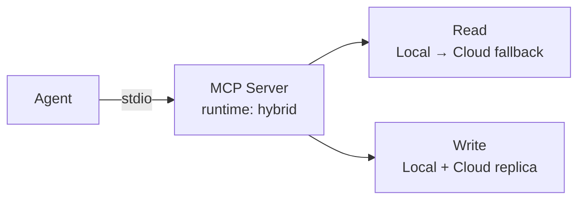

# Hybrid Mode

Hybrid mode runs the MCP server locally over stdio (like the default `local` mode) and **also** connects it to MemoFS Cloud, so reads and writes sync through the hosted replica. Use it when you want an AI agent working on a local checkout to share memory with teammates, CI, and hosted agents.

> [!NOTE]
> If the machine hosting your agent has no checkout at all (CI runners, hosted agents, a teammate's laptop before cloning), skip ahead to the [Hosted MCP Endpoint](./hosted-mcp-endpoint) — it speaks the same protocol over plain HTTP with no local server.

## How it works



- The agent still launches `npx @memofs/mcp-server` as a local stdio child process — clients don't need to speak HTTP.
- Reads and writes hit the project's `.memofs/` directory on disk, so agents stay fast and work offline.
- Writes are also mirrored to the cloud replica at `--cloud-url`; other machines pick them up by running `memofs cloud sync pull`.
- The four memory tools (`memofs.context`, `memofs.recall`, `memofs.remember`, `memofs.consolidate`) use the **same schemas** as `local` mode — agents don't need to know which runtime they're on.

## Configuration

Put the API key in the `env` block so it stays out of committed config. The `--cloud-url` flag is the only required addition to a normal `local` invocation:

```json
{
  "mcpServers": {
    "memofs": {
      "command": "npx",
      "args": [
        "-y",
        "@memofs/mcp-server",
        "--runtime", "hybrid",
        "--cloud-url", "https://memofs.dev/api/v1"
      ],
      "env": {
        "MEMOFS_API_KEY": "your-api-key"
      }
    }
  }
}
```

For project-scoped configs (committed to the repo), omit `--root` — the client launches the server with the project root as its working directory. For global / app-level configs (in your home directory), add `"--root", "/absolute/path/to/project"` to `args`. See the [Manual Integration table](./index#manual-integration) for platform-specific files.

### Required and optional flags

| Flag | Required? | Description |
|---|---|---|
| `--runtime hybrid` | **Yes** | Enables cloud mirroring. Default is `local` (no cloud calls). |
| `--cloud-url <url>` | **Yes** | MemoFS Cloud API root, e.g. `https://memofs.dev/api/v1`. |
| `--root <dir>` | No | Absolute path to the project root containing `.memofs/`. Defaults to the current working directory. Required only in global / app-level configs. |
| `--project-id <id>` | No | The cloud project to mirror to. If omitted, the server uses the project bound to the API key's default workspace. |
| `--workspace-id <id>` | No | Default cloud workspace ID. |
| `--api-key <key>` | No | API key. **Prefer the `MEMOFS_API_KEY` env var** so it stays out of your config file and shell history. |
| `--cloud-timeout-ms <n>` | No | Cloud request timeout in milliseconds. Defaults to the cloud-client default. |
| `--read-only` | No | Blocks all write tools — useful for a shared, append-via-CLI-only flow. |

Every flag has an environment-variable equivalent (passed through the `env` block):

| Variable | Description |
|---|---|
| `MEMOFS_RUNTIME` | Runtime mode: `local` or `hybrid`. |
| `MEMOFS_CLOUD_URL` (or `MEMOFS_API_URL`) | MemoFS Cloud API root. |
| `MEMOFS_API_KEY` | MemoFS Cloud API key — preferred over `--api-key`. |
| `MEMOFS_PROJECT_ID` | Default project ID. |
| `MEMOFS_WORKSPACE_ID` | Default cloud workspace ID. |
| `MEMOFS_CLOUD_TIMEOUT_MS` | Cloud request timeout in milliseconds. |
| `MEMOFS_MCP_READ_ONLY` | Set to `"true"` to block write tools. |

## Choosing an API key scope

API keys are either **read-write** or **read-only** (managed on the [dashboard's API Keys](https://memofs.dev/dashboard/api-keys) page). Each scope enables a different subset of the four memory verbs:

| Key scope | `memofs.context` | `memofs.recall` | `memofs.remember` | `memofs.consolidate` |
|---|:---:|:---:|:---:|:---:|
| Read-write | ✅ | ✅ | ✅ | ✅ |
| Read-only | ✅ | ✅ | ❌ | ❌ |

A read-only key never rejects `context`/`recall` — the write tool calls (`remember`, `consolidate`) fail with an MCP authorization error. Pair this with `--read-only` to belt-and-braces block writes at the protocol layer regardless of key scope.

## When to pick hybrid vs. hosted

| Situation | Use |
|---|---|
| Agent runs on a machine with a checkout and edits memory you want synced to the team | **Hybrid mode** |
| Agent runs in CI, on a hosted runner, or on a laptop that hasn't cloned the repo yet | [Hosted MCP Endpoint](./hosted-mcp-endpoint) |
| Agent runs purely offline against a local `.memofs/` and you don't want cloud calls | `--runtime local` (default, no cloud flags) |

## Troubleshooting

### Cloud sync requires `--cloud-url` and `--api-key` or `MEMOFS_CLOUD_URL/MEMOFS_API_KEY`
The server can't reach the cloud because both a URL and an API key are missing. Either pass `--cloud-url` + `--api-key` (or `MEMOFS_API_KEY`) or supply them via the `env` block.

### Writes return an MCP authorization error
Your API key is read-only. Either mint a read-write key on the API Keys page, or check that the dashboard role you assigned wasn't scoped to read-only by accident. (A read-only key intentionally can't bypass this.)

### Teammates don't see your writes
Hybrid mode pushes writes to the cloud replica, but **other machines don't pull automatically**. Anyone working on the project needs `memofs cloud sync pull` to fetch the latest, or `memofs cloud sync push` to keep their local `.memofs/` up to date in the background.

### No `.memofs/` directory found
The server defaults `--root` to the current working directory. If you launched the agent from outside your project (common with global / app-level MCP configs), add `"--root", "/absolute/path/to/project"` to `args`.

## See Also

- [MCP Server index](./index) — the four memory tools, all flags, and per-client config snippets.
- [Hosted MCP Endpoint](./hosted-mcp-endpoint) — HTTP-only variant for machines with no checkout.
- [CLI memory commands](/packages/cli/memory) — `memofs cloud sync pull` / `memofs cloud sync status` to reconcile local memory with the cloud replica.
