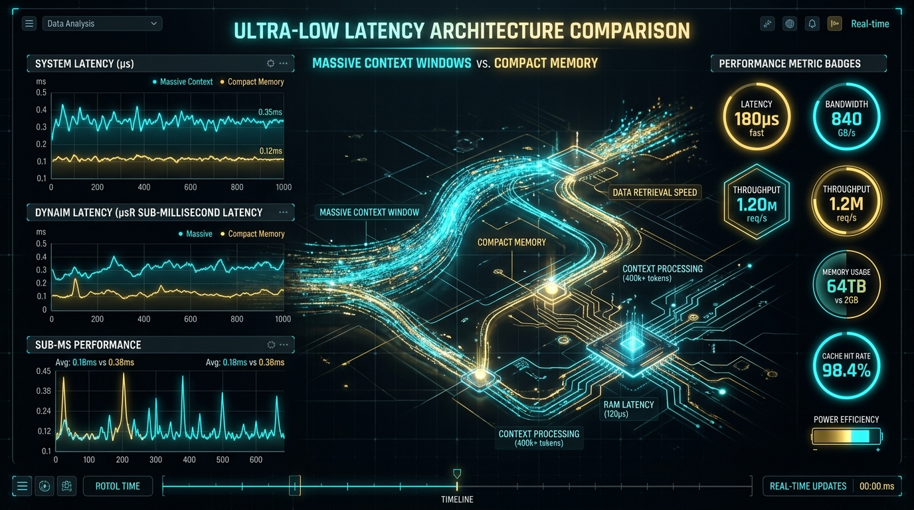

# Benchmarking Agent Context Efficiency: 200k Raw Tokens vs. MemoFS File Memory



> **Platforms**: LinkedIn | X Article | Dev.to  
> **Target Audience**: CTOs, Engineering Leads, AI Framework Builders, AI Systems Researchers & Developers  
> **Key Callouts**:
> - Open Source Docs: [https://docs.memofs.dev](https://docs.memofs.dev)
> - Architecture & Design Post: [https://docs.memofs.dev/blog/the-memory-layer-for-any-ai-agent](https://docs.memofs.dev/blog/the-memory-layer-for-any-ai-agent)
> - Core Package Docs: [https://docs.memofs.dev/packages/core/](https://docs.memofs.dev/packages/core/)

---

As AI coding agents and autonomous workflows become central to software development teams, a major operational challenge has emerged for both users and framework builders: **token inflation, latency, and API bill explosion**.

When developers and custom agent loops rely solely on massive context windows (100k-200k+ tokens), every session re-processes thousands of lines of past logs, full conversation transcripts, and raw files. This approach is costly, slow, and prone to context window attention loss.

In this benchmark report, we analyze the performance metrics of **MemoFS**—the file-first memory runtime for AI agents—measured using `@memofs/benchmark-kit` across local release workloads.

---

## Key Benchmark Results (Release Workloads)

The following benchmark metrics were gathered locally on synthetic dataset workloads using the official `@memofs/benchmark-kit` release suite (`pnpm benchmark:release`):

| Metric | Measured Value (p50) | Description / Workload |
| :--- | :--- | :--- |
| **Recall Latency (p50)** | **`0.6 ms`** | Top-10 in-memory recall over a complete project memory set. |
| **Round-trip Latency (p50)** | **`7.4 ms`** | Full read + write lifecycle for the core memory store. |
| **Rerank Latency (p50)** | **`0.2 ms`** | Deterministic top-5 rerank after hybrid recall. |

```
+-------------------------------------------------------------------+
|                        BENCHMARK SUMMARY                          |
+-------------------------------------------------------------------+
|  Recall Latency (p50):    0.6 ms   [Top-10 recall over store]     |
|  Round-Trip Latency (p50): 7.4 ms   [Full read + write lifecycle]   |
|  Rerank Latency (p50):    0.2 ms   [Top-5 rerank after recall]    |
+-------------------------------------------------------------------+
```

---

## Architectural Comparison: Raw Context vs. MemoFS

| Dimension | Raw 200k Context Window | MemoFS Memory Layer |
| :--- | :--- | :--- |
| **Storage Primitive** | Temporary Model KV Cache | Versioned Files in `.memofs/` |
| **Prompt Overhead** | ~100,000 – 200,000 tokens | **~1,500 – 2,500 tokens (~6 KB)** |
| **Recall Time** | 1,500ms – 5,000ms (LLM prefill) | **0.6ms (Local MemoFS recall)** |
| **Context Retention** | Wiped when session ends/compacts | **Durable & Git-Tracked** |
| **Secret Protection** | Risk of sending secrets in prompt | **Write-time Secret Rejection** |
| **Offline Operation** | Requires active cloud endpoint | **100% Offline Local Mode** |

---

## Why MemoFS Achieves Sub-Millisecond Recall

MemoFS achieves sub-millisecond retrieval through three structural decisions:

### 1. In-Memory Derived Indexes
While `.memofs/memory/notes.md` is the canonical text file, MemoFS maintains derived in-memory BM25 chunk indexes and fuzzy lookup maps. Querying context takes **`0.6ms`**, returning only relevant memory blocks.

### 2. Task-Aware Context Filtering
Instead of returning all historical notes, `memo.context()` accepts a `taskType` parameter (`coding`, `debug`, `refactor`, `docs`, `general`). The engine filters out unrelated memories before generating the final prompt briefing.

### 3. Fast Deterministic Reranking
After initial lexical and hybrid vector retrieval, MemoFS applies a lightweight deterministic reranker that scores results by recency, tag relevance, and graph superseding state in **`0.2ms`**.

---

## Token Cost & Latency Impact: Users vs. Builders

Consider an AI coding session or autonomous agent trajectory running 20 turns on a complex codebase:

- **Without MemoFS**: Sending a 100k token context window on every turn consumes **2,000,000 input tokens**. At standard API pricing, a single session costs several dollars and introduces 3-5 seconds of latency per turn.
- **With MemoFS**: MemoFS compresses project knowledge into a ~6 KB briefing (~1,500 tokens). Over 20 turns, input token consumption drops to **30,000 tokens**—a **98.5% reduction in token overhead** with sub-10ms memory retrieval.

### What This Means for Users & Builders

- **For Agent Users**: Interacting with Claude Code, Cursor, or Copilot feels instant. There is no 5-second lag per turn while the model re-indexes raw conversation history.
- **For Agent Builders**: Scaling autonomous agent workflows becomes financially viable. Autonomous multi-agent pipelines run 20+ loop iterations without running up astronomical LLM bills or hitting rate limits.

---

## Summary & Benchmark Methodology

All performance benchmarks are deterministic and reproducible. To run release benchmarks on your local environment:

```bash
# Clone the open-source repository
git clone https://github.com/memo-fs/memofs.git
cd memofs

# Install dependencies and run release benchmarks
pnpm install
pnpm benchmark:release
```

Detailed methodology and benchmark kit source code are available in the [`@memofs/benchmark-kit`](https://docs.memofs.dev/packages/benchmark-kit) package.

---

## Learn More

- **Main Documentation**: [https://docs.memofs.dev](https://docs.memofs.dev)
- **Architecture Deep Dive**: [https://docs.memofs.dev/blog/the-memory-layer-for-any-ai-agent](https://docs.memofs.dev/blog/the-memory-layer-for-any-ai-agent)
- **SDK Reference**: [https://docs.memofs.dev/packages/core/](https://docs.memofs.dev/packages/core/)
